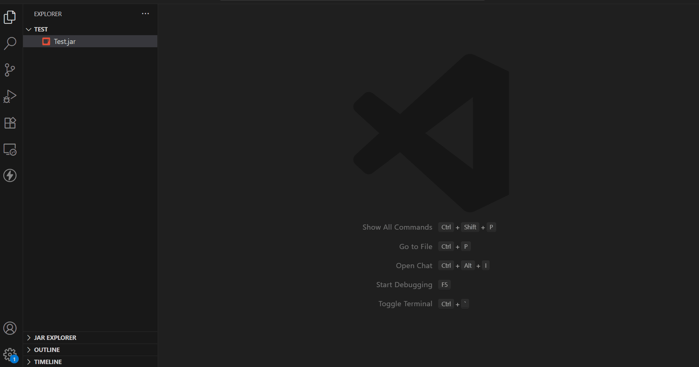
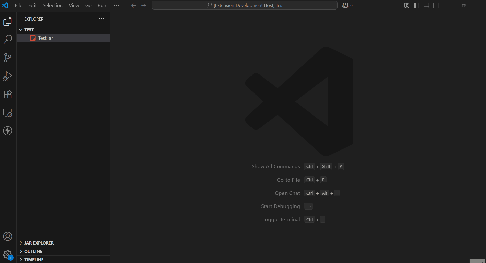

# 🧩 JAR Explorer

A Visual Studio Code extension to **explore and decompile `.jar` files**. Browse contents in a tree view, view `.class` files, and render Java source using a custom decompiler tool like CFR—all inside VS Code.



---

## ✨ Features

- 📁 Tree view of JAR file structure
- 🧬 View `.class` files with syntax highlighting
- 🧪 Uses your custom JAR-based decompiler (e.g. CFR)
- ⚙️ Configurable paths for JAR and JDK
- ⏳ Shows loading state while decompiling
- 🚫 Optionally supports cancel/decompile timeout
- 🧹 Clean and modern webview interface

---

## 📽 Demo


---

## ⚙️ Requirements

- **Java JDK 21** installed or added to PATH
- Optionally set the default JAR path in settings

---

## 🔧 Extension Settings

This extension contributes the following settings:

| Setting | Description |
|--------|-------------|
| `jarExplorer.jdkPath`  | Path to your Java executable (`java`) |

You can add these in your `settings.json`:

```json
{
  "jarExplorer.jdkPath": "/path/to/java",
}
```


