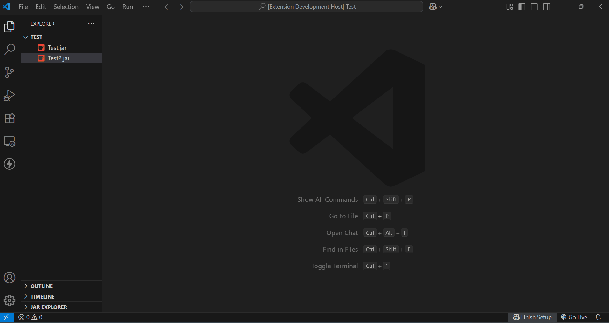

# 🧩 JAR Explorer

**A Visual Studio Code extension to explore and decompile `.jar` files.**  
Browse contents in a tree view, view `.class` files and other resources, and render Java source using a custom decompiler tool like [CFR](https://www.benf.org/other/cfr)—all inside VS Code.



---

## ✨ Features

- 📁 **Tree view** of JAR file structure  
- 🧬 View `.class` files with **syntax highlighting**  
- 🧪 Integrates with your custom JAR-based decompiler (e.g. [CFR](https://www.benf.org/other/cfr))  
- ⚙️ Configurable paths for both **JAR** and **JDK**  
- ⏳ Displays **loading state** while decompiling  
- 🚫 Supports **cancellation** or automatic **decompile timeout**  
- 🧹 Clean and **modern WebView interface**  
- 📂 Handles **multiple JAR files** simultaneously  

---

## 📽 Demo


---

## ⚙️ Requirements

- **Java JDK 21** installed or added to PATH

---

## 🔧 Extension Settings

This extension contributes the following settings:

| Setting | Description |
|--------|-------------|
| `jarExplorer.jdkPath`  | Path to your Java executable (`java`) |

You can add these in your `settings.json`:

```json
{
  "jarExplorer.jdkPath": "/path/to/java",
}
```


## 📝 Release Notes

### Version 0.0.1 

- Initial beta release with support for viewing `.class` files.

### Version 1.0.0

- Added support for viewing files other than `.class` files within the `.jar`.
- Improved file opening behavior and view handling.
- Multiple `.jar` files can now be opened simultaneously in the Jar Explorer tab.
- This is stable release.

## 💳 Creadits

We have used the CFR Decompiler (https://www.benf.org/other/cfr) to reverse engineer .class files. CFR was chosen for its accuracy, support for modern Java features, and ease of integration into Java-based tooling workflows.